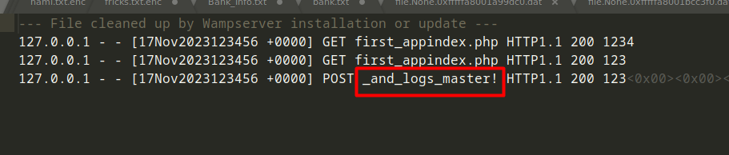
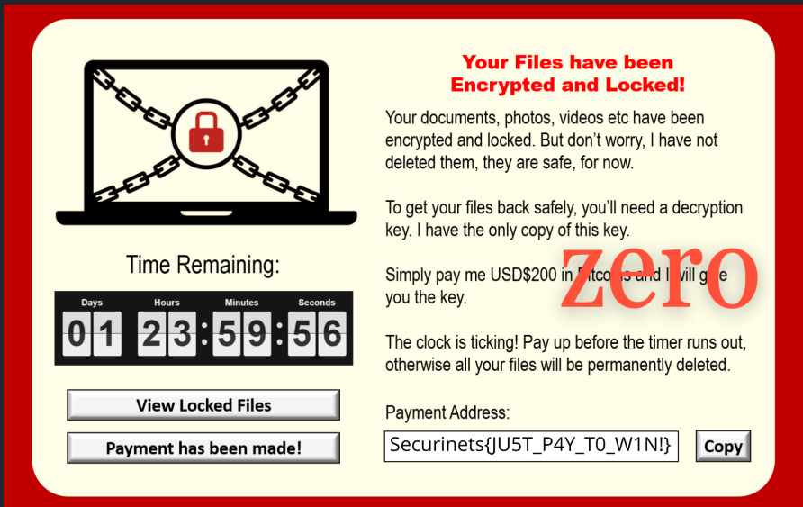
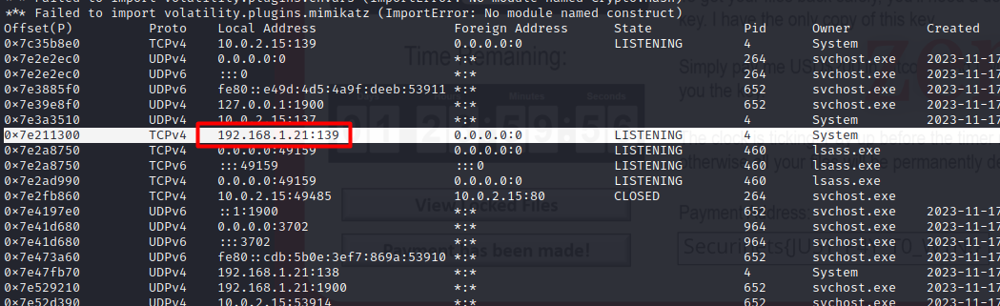
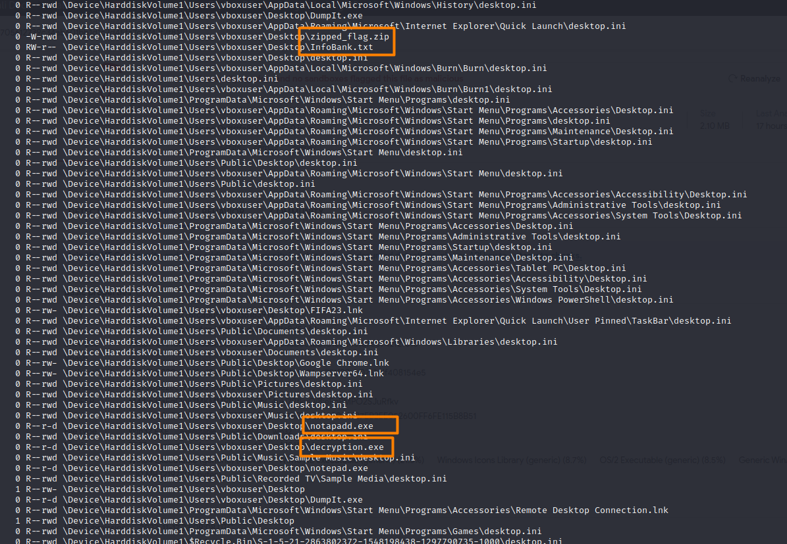
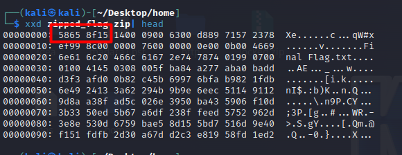
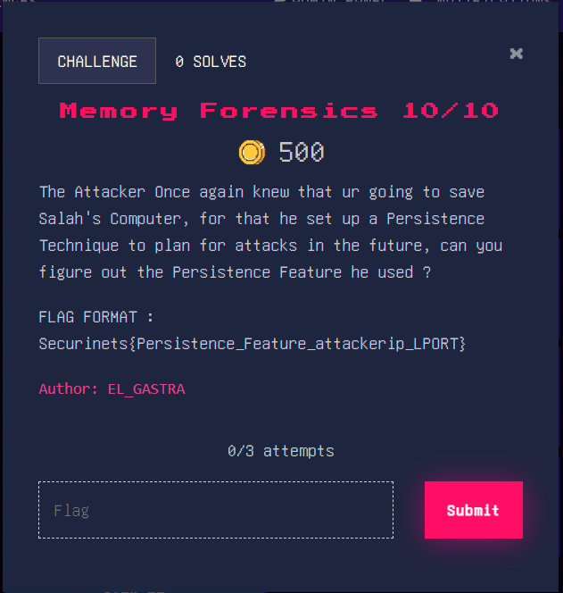

# ISI-Mini-CTF-Forensics-Writeup
A beginner friendly Capture The Flag (CTF) where I created a windows7 Memory Dump in order to investigate an attack on a computer using the volatility tool, the tasks were guided to introduce new comers into the world of cybersecurity to dive into memory analysis.

#### Download the memory dump file via this [link](https://drive.google.com/file/d/1hlxiV4N9y_7RvjyjkBtUdm2ZCUQUcXYK/view?usp=sharing)

## Task 01 : 
For the first tasks the players were introducesd to some concepts such as : What is volatile data ? what is Memory forensics ? what are the tools used to conduct the analysis ?
The Answers to these questions were provided in [this doc file](https://docs.google.com/document/d/1vAC9tJZMKjT2bFU-GxcbnGEJO1Zxh-1-YmhqNOvGFNM/edit?usp=sharing) along with an intro flag as a reward.


`Flag 01 : Securinets{Lets_Get_Started_With_Memory_Analysis}`
## Task 02 :


Running the imageinfo command can grant us the profile that we will use for the investigation : ``` python2 vol.py -f lasten.raw imageinfo  ```

 


`Flag 02 : Securinets{Win7SP1x64}`

## Task 03 : 
For the third one we were asked for the OS and Computer Name.


 since we have the operating system from the profile, all we need is the Computer Name which we can either obtain by running the envars plugin
in the volatility ``` python2 vol.py -f lasten.raw --profile=Win7SP1x64 envars ``` or grep for it from the memory dump file using Strings command.


`Flag : Securinets{WINDOWS_GASTRA-WIN7}`
## Task 04 :
The 4th task mission was to extract salah source code and his logs to unravel the two parts of the flag.


if we run the ```python2 vol.py -f lasten.raw --profile=Win7SP1x64 pslist (or pstree) ``` plugin we notice that Salah was using Wampserver which is Apache web server. We can find his applications under the www directory : 


<br>
Let's us check the files under these directories by scanning for files using ```python2 vol.py -f lasten.raw --profile=Win7SP1x64 filescan```  :
<br>


We notice the index.php file let's dump it using the dumpfiles plugin ```python2 vol.py -f lasten.raw --profile=Win7SP1x64 dumpfiles -Q 0x000000007fd82b70 -D ~/Desktop``` the -Q is the virtual address of the memory you want to extract  and the -D is to specify in which directory to dump the file once we read his source code we get the first part of the flag : 


We will do the same steps to extract his log files : 



`Securinets{always_check_source_code_and_logs_master!}`

## Task 05 : 
For the next one the player should be familiar with dumping files so it's getting easier.


Flag : <br> 

## Task 06 : 
Now the attack has took place let's investigate more through this task :


In Order to find Salah's ip we could scan the network by using the netscan plugin ```python2 vol.py -f lasten.raw --profile=Win7SP1x64 netscan -v``` : 



For the Sus application he installed we have many ways the best one is to use the chromehistory plugin which needs to be installed it gives you his web browser history and find out that he downloaded FIFA23 , or we can just check his downlaods / Google History files or the working processes to know this information.


Flag : `Securinets{192.168.1.21_FIFA23}`

## Task 07 :

now we are gonna gather some informations about the attack.


running the pslist command we notice ther's a sus process named `notapadd.exe`


after investigation we found the file was located on the victim's desktop the moment the attack happend let us dump this file and gather more information : 




a lot of interesting files were found `zipped_flag.zip` `decryption.exe` `InfoBank.txt` but we will dig through these ones later in the tasks for now let us focus on the `notapadd.exe` which seems to be the malicious file, we are not gonna dive into reversing this file since this is a guided CTF but let us scan the file in VirusTotal. <br>


from the Behaviour we notice that it is a compiled go code that is encrypting the victim's important data using AES256, this is known as a Ransomware,
The Vhash is basically an in-house similarity clustering algorithm value, based on a simple structural feature hash allows you to find similar files. Having all these information we can gather the puzzles for our  flag.

`Flag : {notapadd.exe_ 0260f6151d1515150505bz2d!z_ransomware}`

## Task 08 : 

For this challenge we have to help salah infected file : <br>


after revealing in the Task 07 the files on salah's dektop `InfoBank.txt` & `decryption.exe` and knowing that the attacker used AES with base64, we just need to decrypt the Infected file file, let's dump the file as usual.

file content :  <br>


However for AES256 is a symmetric encryption which means that the same key is used for both the encryption and decryption processes,so
we have to find that key in order to decrypt our file content, the naive attacker however copied the key while setting up his malicious file, for this the volatility tool contains a plugin that dumps whatever was on the clipboard at the time of the attack using (Well this was supposed to be a hint but since the previous challenges weren't solved i didn't post it) 
```python2 vol.py -f lasten.raw --profile=Win7SP1x64 clipboard```


There you go having all these you can easily use an online decryption tool to decrypt the file which is obviously the flag.


decrypting the base64 Flag gives : `Securinets{A3S_Encryp7i0n_1s_1n53CUR3}`

## Task 09 :


One of the files we discovered in the Task 07 was named `zipped_flag.zip` let us try to dump it and check its content : 


The file seems to be corrupted by the attacker which means some header bytes were modified , every file type(png,jpg,zip...etc) have a unique bytes signature let us see how we can fix this file by giving it the right signature, Google is our friend : 

Let us check if our header bytes match by running xxd command on the zip file : <br>



We can see that the first 4 bytes aren't as they supposed to be for that wel will use Hexedit tool to fix the file header and exporting it again : <br>


The file is fixed let's get our flag now, however the zip was password secure while trying to open the file : <br>


you can try to bruteforce attack the password but it won't work since the naive hacker hid the password somewhere on this machine which he did in the windows registry (again  this was supposed to be a hint but since the previous challenges weren't solved i didn't post it),
we can check the hives on the victim's machine by using the hivelist plugin ```python2 vol.py -f lasten.raw --profile=Win7SP1x64 hivelist````: 


The password was a registry key a in the Software branch which is a specific branch within the user's registry where application and system software settings are storedunder `\SystemRoot\System32\Config\SOFTWARE`, let us see the registries under this branch using the `printkey` plugin with the virtual address of that branch using ```python2 vol.py -f lasten.raw --profile=Win7SP1x64 printkey -o 0xfffff8a000b54010```


that's it for task 09 let's reveal the zip file with that password `a7la_securinets_isi`.

Flag : `Securinets{Reg1stry_h0ld5_50_MuCh!}`

## Task 10 : 
the attacker set up a technique in order to gain access to salah's machine in the future using a well known windows feature, we have to gather information about what was the attacker strategy for revenge.<br>



Ife we keep on investigating the files we will notice that the user Appdata directory contains some Sus filesprofile since it's less likely for the to visit this hidden folder we found that the attacker left two powershell Scripts : 


The Createback.ps1 file was basically setting up a schedulked task using the Task scheduler feature to run the backagainn.ps1 script daily :


The Backagainn.ps1 file was a reverse shell connection that runs daily on Salah's machine,a reverse shell is basically a type of shell in which the target machine initiates a connection to the attacker’s machine, allowing the attacker to execute commands on the target machine remotely. 


Having all of the information necessary let's assemble our flag : `Securinets{Task_Scheduler_149.100.50.25_4444}`

# Final Thoughts : 
Hope you enjoyed this set of tasks,however after I completed the creation of this task i realized it wasn't very beginner friendly except for the first ones, you can always try to solve this at your own and ask if you need any help, it is a bit challenging for a first timer but it's definetly a beneficial skill to acquire in the journey of learning cybersecurity.


